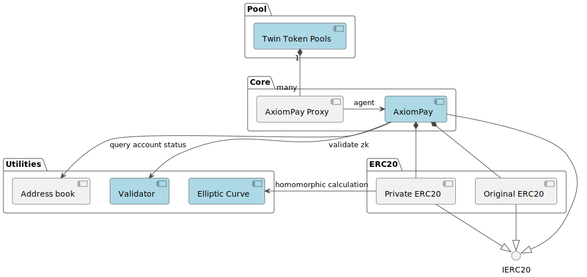

# AxiomPay Contract

AxiomPay expands existing stablecoin payments into a tool that can simultaneously support both real-world and virtual payments, while ensuring user privacy and meeting the criteria of portability, regulatory compliance, high performance, and user-friendliness.

AxiomPay enhances the privacy of existing popular stablecoin contracts by combining zero-knowledge proof payment verification, homomorphic encryption for balance calculations, and MPC-based View Key technology. It maintains the protocol's composability, portability, and user-friendliness. Furthermore, through L2 and hardware acceleration, it provides faster transaction speeds for stablecoin payments, enabling support for larger-scale use cases in the future.

## Contract Structure

